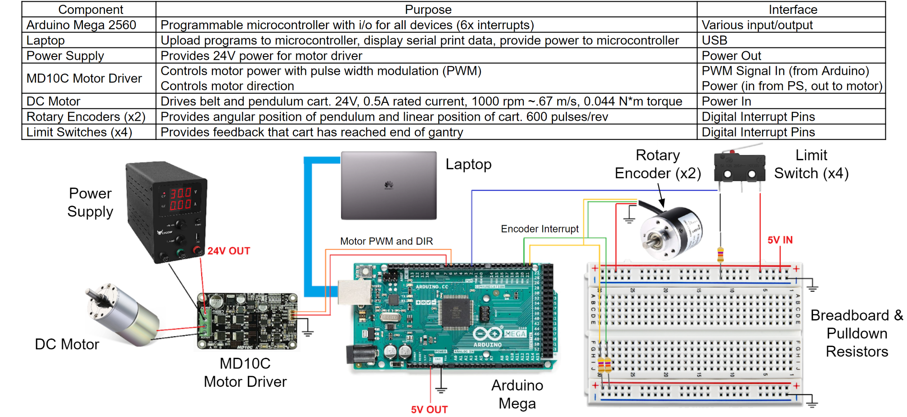
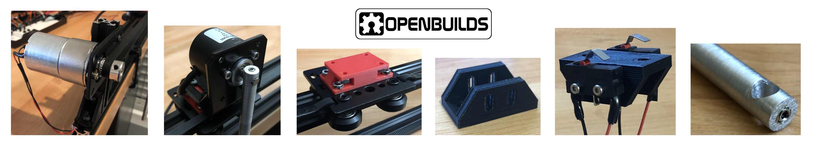
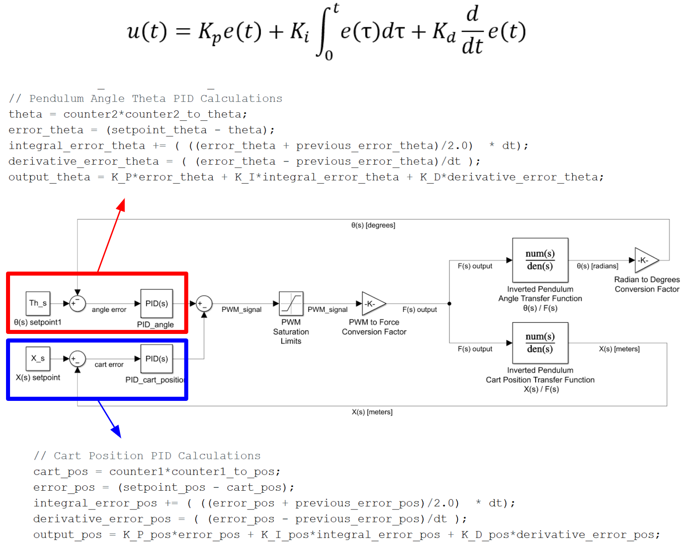
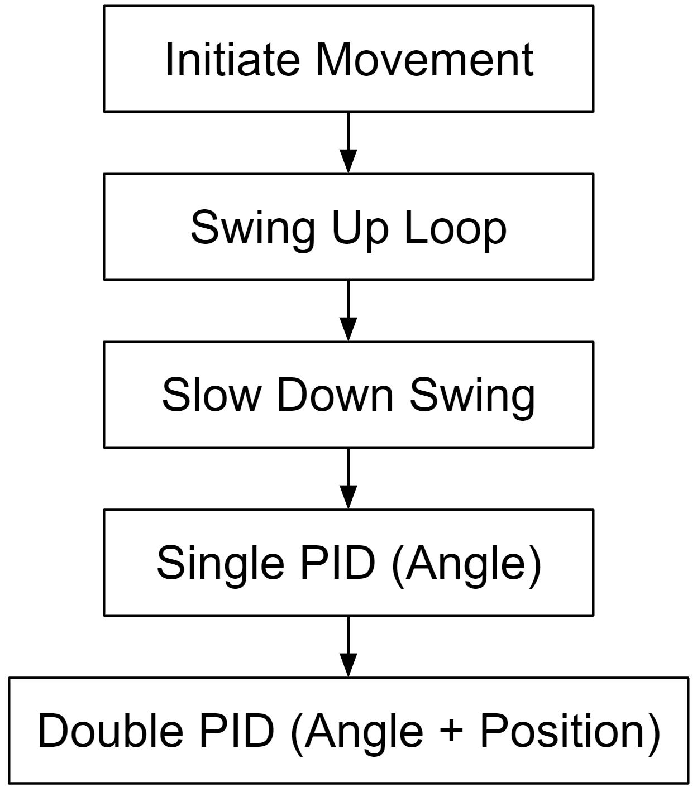
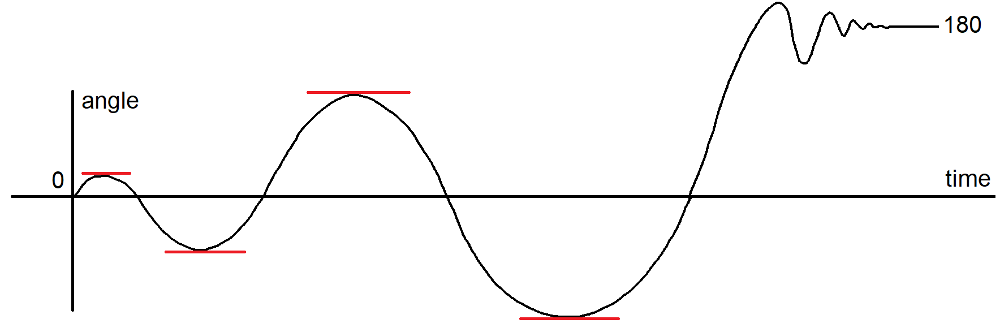

# Inverted Pendulum
Project repository for a cart-pole inverted pendulum system. Designed hardware and software to support feedback control of belt gantry, DC motor, encoders, motor driver, and microcontroller. Developed a self swing up startup sequence and a double PID control algorithm with no external libraries that can successfully balance an inverted pendulum for 30+ seconds.

Video files: [Swingup and Balance](images/swingup_and_balance.MOV), [Balance](images/balance.MOV)

## System Overview
System consists of a pendulum and encoder assembly driven via a linear belt gantry and DC motor controlled with an Arduino equivalent microcontroller.

### Electrical System

### Mechanical Hardware

- [OpenBuilds](https://openbuilds.com/) Hardware: V-slot linear rail, V-slot gantry, brackets, fasteners, t-nuts
- Modified Stepper Brackets: DC motor and pendulum encoder mounting
- 3D Prints: Gantry and limit switch brackets
- Timing belt and pulleys
- Pendulum rod

## Software and Control

### Closed Loop Control

The main software loop running on the microcontroller consists of a double PID control scheme for pendulum angle and cart position. The previous error and current error for each position are used to perform numerical differentiation and numerical integration (midpoint integration). A combined error is then used to determine motor control. PID gains were heuristically determined with methods roughly similar to Ziegler–Nichols.

    

A few functions are used in support of the main loop operation:
- Motor Function: Used to control motor direction and current with a PWM signal
- Encoder Functions: Interrupt pins on the arduino are used to increment or decrement the encoder count
- Limit Switches: Used for system safety. If any limit switch interrupt is triggered, motor current set to zero.

### Swing Up Program

An initial swing up program is used to bring pendulum from dead hang to an inverted position. Desired swing up behaviour can roughly be viewed as a growing oscillatory sin wave where pendulum swings with more and more force from left to right and eventually snaps into a control loop once upright. Once inverted the program does not immediately enter the main double PID loop, but instead enters a single PID loop just controlling the pendulum angle. During testing the single PID control proved to be more robust to catching a swing up, and once stable the program continues to the main loop.

    
    

### Balancing

## Misc. Images

Motor soldering

  

 

Limit switch wiring EMI shielding. Had an issue with intermittent system shutdowns and root caused the problem to motor EMI noise causing interrupts to switch. Wire shielding resolved issue.

  

 

Motor winding overcurrent damage when system railed during testing. Led to the development of limit switch safety features to prevent this failure mode.

  

 

Limit switch bracket

  

